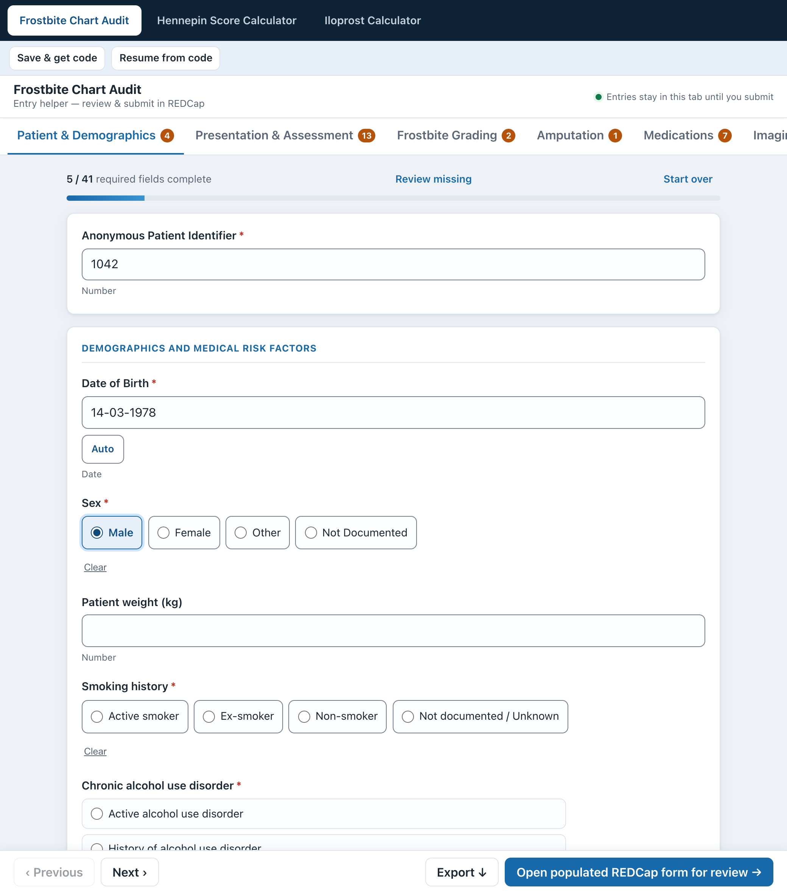
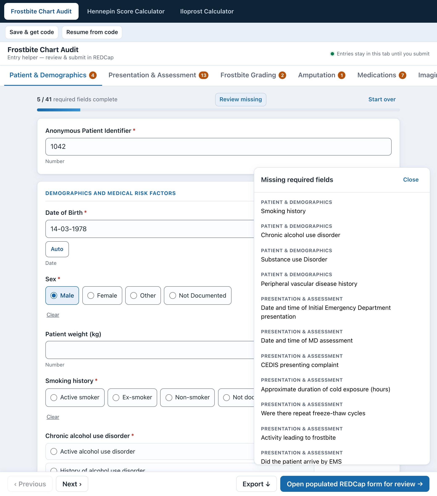
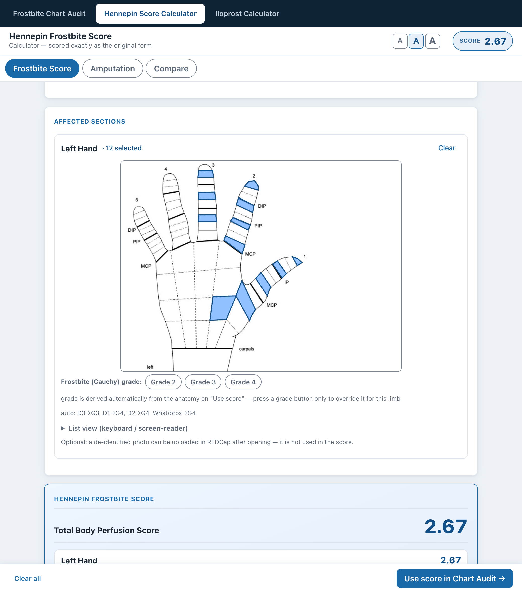
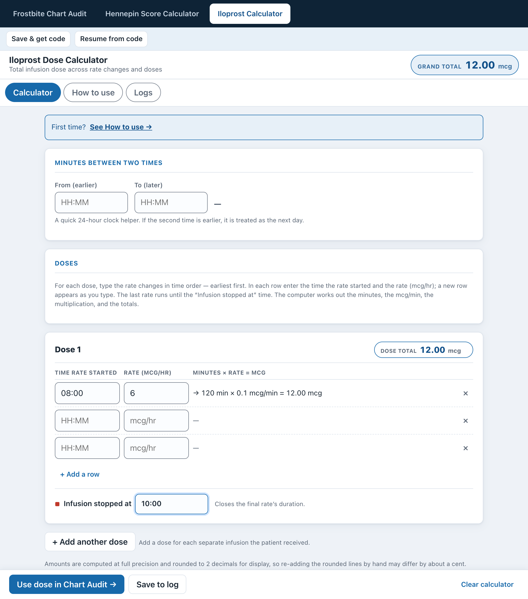
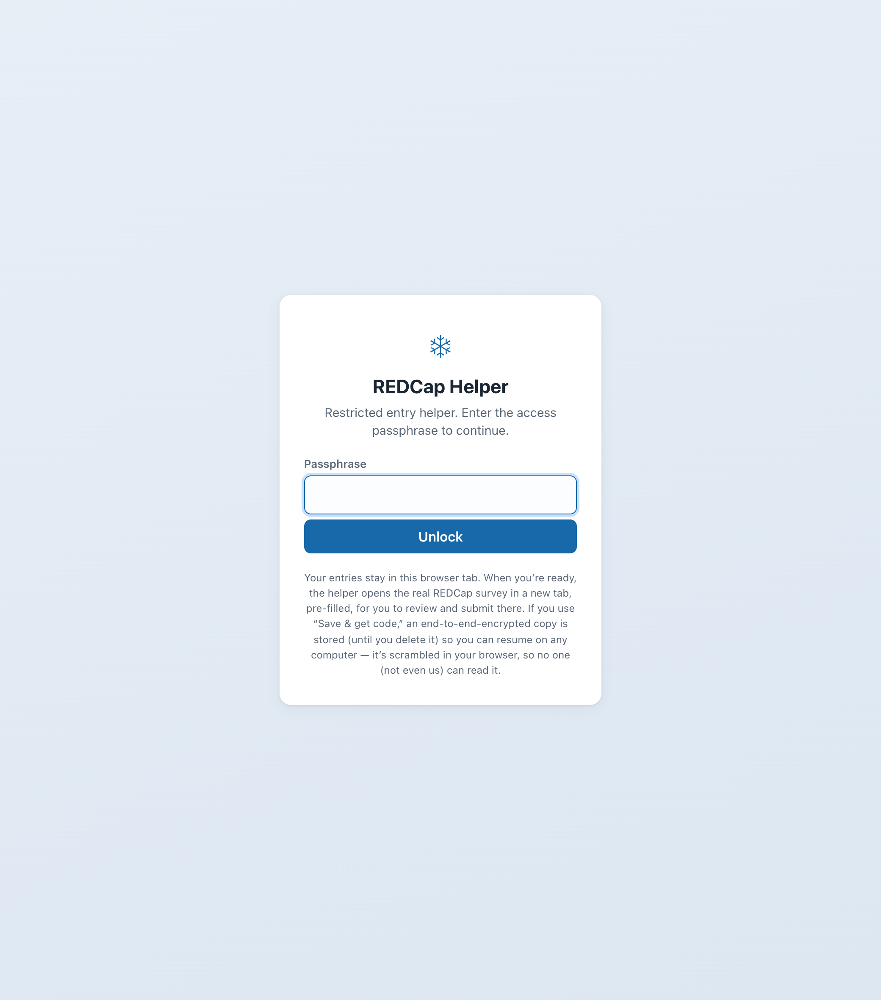
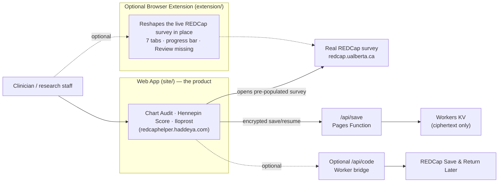

# Frostbite REDCap Helper

*A hosted web app for faster, less error-prone high-grade frostbite chart-audit data entry into REDCap — with a Hennepin Score calculator, an Iloprost dose calculator, and zero-knowledge save/resume.*

[](LICENSE)
[](https://redcaphelper.haddeya.com)
[](https://redcaphelper.haddeya.com)
[](#tech-stack)

**Frostbite REDCap Helper** is a hosted, entirely client-side web app — live at **[redcaphelper.haddeya.com](https://redcaphelper.haddeya.com)** — that helps clinicians and research staff enter high-grade frostbite chart-audit data into [REDCap](https://www.project-redcap.org/) faster and with fewer missed fields. There is nothing to install: you open the page and start entering. It bundles three purpose-built tools plus an encrypted save/resume feature, and hands off to the real REDCap survey for final review and submission. An optional browser extension is also included for teams who prefer to work directly on the live REDCap survey page.



## Table of contents

- [How to use it](#how-to-use-it)
- [Features](#features)
- [The three tools](#the-three-tools)
- [Save & resume, without us ever reading your data](#save--resume-without-us-ever-reading-your-data)
- [Privacy & safety](#privacy--safety)
- [Architecture at a glance](#architecture-at-a-glance)
- [Repository layout](#repository-layout)
- [Getting started](#getting-started)
- [Testing](#testing)
- [Security & privacy](#security--privacy)
- [Roadmap](#roadmap)
- [Tech stack](#tech-stack)
- [Authors](#authors)
- [License](#license)
- [Acknowledgements](#acknowledgements)

## How to use it

**The web app is the product.** Just open **[redcaphelper.haddeya.com](https://redcaphelper.haddeya.com)**, enter the access passphrase, and start entering data — it runs entirely in your browser, on any computer, with nothing to install.

When you're done, the app opens the **real REDCap survey pre-populated** in a new tab so a human reviews and submits it there. REDCap remains the system of record, and its own branching logic and validation always run.

<details>
<summary><b>Optional:</b> browser extension (advanced)</summary>

For teams that prefer to work directly on the live REDCap survey page, the repo also includes a Manifest V3 browser extension (in [`extension/`](extension)) that reshapes the survey **in place** into the same 7 tabs, without moving or altering any REDCap field. It makes no network calls and stores nothing. It is entirely optional and separate from the hosted app — see [extension/README.md](extension/README.md) to load it.

</details>

## Features

- **Three purpose-built tools** behind one switcher: a Frostbite Chart Audit form, a Hennepin Score calculator, and an Iloprost dose calculator
- Regroups a long survey into **7 logical tabs**: Patient & Demographics; Presentation & Assessment; Frostbite Grading; Amputation; Medications; Imaging & Consults; Disposition & Follow-up
- A live **required-fields progress bar** with per-tab completion badges
- A **"Review missing"** jump list that takes you straight to any outstanding required field
- Typed **date masking** (`DD-MM-YYYY`) and one-click date pre-fill, so dates are less fiddly to enter correctly
- **CSV / XLSX export** of the chart-audit data
- **Save & resume by code** — encrypted per record, readable only by whoever holds the code (see below)
- Opens the **real REDCap survey pre-populated** for a human to review and submit — never submits on your behalf

## The three tools

### Frostbite Chart Audit

A cleanly grouped, from-scratch re-implementation of the survey. Fill it out at your own pace, then submit: the app opens the **real REDCap survey pre-populated** in a new tab so a human reviews and submits it there — REDCap stays the authoritative system of record. Supports CSV and XLSX export of entered data.



### Hennepin Score Calculator

An interactive calculator for the [Hennepin Frostbite Score](https://redcap.hhrinstitute.org), used to grade frostbite severity. Click the affected regions directly on anatomical hand, foot, and proximal diagrams, and the score is computed live using **REDCap's own scoring equations, baked in verbatim** — so the result is provably identical to what REDCap itself would calculate. The result can be pushed straight into the Chart Audit. See [docs/HHR_SPEC.md](docs/HHR_SPEC.md) for the full scoring model.



### Iloprost Calculator

A local infusion-dose calculator for iloprost (mcg over a series of rate changes), with a saved log of prior calculations. Its result can also be pushed into the Chart Audit.



## Save & resume, without us ever reading your data

Clicking **"Save & get code"** encrypts the combined state of all three tools *in the browser*, using a **fresh, random 256-bit AES-GCM key generated for that save alone**. Only the ciphertext (`{ct, iv}` plus a `dtok`) is ever uploaded — to a small Cloudflare Pages Function (`/api/save`) backed by Workers KV.

The encryption key **never leaves the browser** except as part of the save code itself, which is shaped `<id>.<key>`. The `<id>` locates the encrypted record; the `<key>` after the dot is required to decrypt it. That means:

- The server, and Cloudflare, **can never read a saved record** — this is a genuine zero-knowledge design, not just "encrypted at rest."
- A single leaked code exposes exactly **one** record, and nothing else.
- `dtok` is `SHA-256(key)`, stored server-side purely as a capability token to authorize deleting/overwriting *that one* record — it does not reveal the key itself.
- Paste the whole code back in, on any computer, to resume or delete that record.

An **optional bridge Worker** (`worker/`) can make the save code equal to REDCap's own native "Save & Return Later" return code — the part before the dot *is* that REDCap code, so a user can resume directly inside REDCap too. If the bridge isn't deployed, the app quietly falls back to a random app-only code; nothing else changes. See [docs/REDCAP_BRIDGE.md](docs/REDCAP_BRIDGE.md) for the full trust model.



The access-passphrase gate shown above is a soft UI convenience (and doubles as the bridge's authorization header) — it is **not** access control and does not protect saved data on its own. For a hardened deployment, put the site behind [Cloudflare Access](https://developers.cloudflare.com/cloudflare-one/policies/access/).

## Privacy & safety

- The web app **only ever uploads ciphertext it cannot read**, and only when you choose to save; it never submits to REDCap on your behalf — you always review and submit in REDCap yourself.
- Saved records are encrypted client-side with a **random per-record key** that lives only inside the save code.
- REDCap remains the **system of record**, and its own branching logic and validation always run.
- The optional browser extension makes **no network calls**, stores **nothing** (no `localStorage`, `sessionStorage`, or cookies), and never moves, clones, or overwrites a REDCap field — it only reshapes layout and adds UI on top.

## Architecture at a glance



See [docs/ARCHITECTURE.md](docs/ARCHITECTURE.md) for the detailed breakdown.

## Repository layout

```
README.md  LICENSE  package.json  package-lock.json  wrangler.jsonc
site/       -> the web app (index.html, app.js, and modules; hhr/ figures)  ← the product
functions/  -> functions/api/save.js (Pages Function, the encrypted blob store)
worker/     -> optional Cloudflare Worker save-code bridge
extension/  -> optional browser extension (manifest.json, content.js, styles.css)
tools/      -> Python parsers + Node/jsdom test suite
docs/       -> ARCHITECTURE.md, DEPLOY.md, REDCAP_BRIDGE.md, TESTING.md, HHR_SPEC.md, images/
```

## Getting started

**Just want to use it?** Open **[redcaphelper.haddeya.com](https://redcaphelper.haddeya.com)** and enter the access passphrase. There is nothing to install — it runs entirely in your browser.

**Working on it locally?** The web app is static and client-side only — no build step, no bundler. Serve `site/` with any static file server, for example:

```bash
npx wrangler pages dev site
# or
python3 -m http.server --directory site
```

**Deploying?** See [docs/DEPLOY.md](docs/DEPLOY.md) for the full Cloudflare Pages + Functions + Workers KV deployment chain, including the optional save-code bridge Worker.

**Using the optional extension?** Open your browser's extensions page, enable Developer mode, and *Load unpacked* → the `extension/` folder. See [extension/README.md](extension/README.md).

## Testing

The project uses a hand-rolled Node assertion suite plus jsdom-based UI tests — there is no test framework to install. Run any suite directly:

```bash
node tools/test_cryptosave.js
node tools/test_hhr_calc.js
node tools/test_export.js
# ...and the other tools/test_*.js files
```

See [docs/TESTING.md](docs/TESTING.md) for the full list and what each suite covers.

## Security & privacy

- Each saved record is encrypted client-side with its own **random** AES-GCM key; the server only ever stores and returns ciphertext it cannot decrypt.
- The save code is the only place the decryption key exists outside the browser that created it.
- Deleting or overwriting a saved record requires proving possession of its key (`dtok`), so a leaked id alone can neither read, clobber, nor erase a record.
- REDCap remains the system of record for the chart-audit data.

## Roadmap

- **Desktop app version** *(under consideration)* — packaging the web app as a standalone desktop application (e.g., via [Tauri](https://tauri.app/) or Electron) so it can run without a browser tab, while keeping the same client-side, zero-knowledge design. Ideas and contributions welcome.

## Tech stack

- Hand-written **vanilla JavaScript** — no framework, no bundler, no build step
- **Cloudflare Pages** + **Pages Functions** + **Workers KV** for the web app and save/resume
- An optional **Cloudflare Worker** save-code bridge (pure-HTTP driver, with a Puppeteer/Browser Rendering fallback)
- **Python** parsers (`tools/parse_survey.py`, `tools/parse_hhr.py`) that regenerate the data dictionaries and calculator logic from saved REDCap survey HTML
- A hand-rolled **Node** assertion test suite plus **jsdom** UI tests (`node tools/test_*.js`)
- An optional Manifest V3 **browser extension** (vanilla JS content script)

## Authors

- **Haddeya Sultani**
- **Shahzaib Ahmed**

## License

Released under the [MIT License](LICENSE).

## Acknowledgements

- The **Hennepin Frostbite Score** originates from its authors and the Hennepin Healthcare Frostbite / HHR Institute, hosted at [redcap.hhrinstitute.org](https://redcap.hhrinstitute.org). This project reimplements its published scoring equations verbatim for the interactive calculator.
- **REDCap** is a trademark of Vanderbilt University. This project is an independent helper tool and is not affiliated with or endorsed by Vanderbilt University or the REDCap Consortium.
