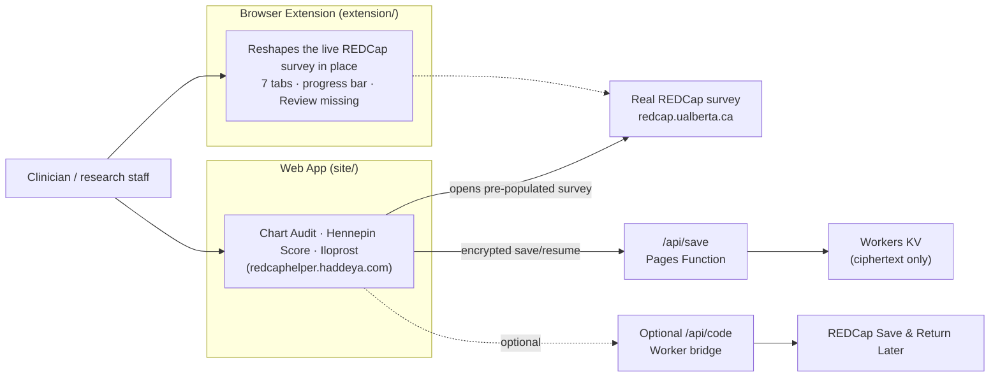

# Frostbite REDCap Helper

*Faster, less error-prone chart-audit data entry for the high-grade frostbite REDCap survey — as a browser extension or a standalone web app.*

[](LICENSE)
[](extension)
[](https://redcaphelper.haddeya.com)
[](#tech-stack)

**Frostbite REDCap Helper** helps clinicians and research staff enter high-grade frostbite chart-audit data into [REDCap](https://www.project-redcap.org/) faster and with fewer missed fields. It ships as a Manifest V3 browser extension that reshapes the live REDCap survey in place, and as a companion web app — live at **[redcaphelper.haddeya.com](https://redcaphelper.haddeya.com)** — for anyone who can't install an unpacked extension.


## Table of contents

- [Two ways to use it](#two-ways-to-use-it)
- [Features](#features)
- [The three web tools](#the-three-web-tools)
- [Save & resume, without us ever reading your data](#save--resume-without-us-ever-reading-your-data)
- [What it deliberately does NOT do](#what-it-deliberately-does-not-do)
- [Architecture at a glance](#architecture-at-a-glance)
- [Repository layout](#repository-layout)
- [Getting started](#getting-started)
- [Testing](#testing)
- [Security & privacy](#security--privacy)
- [Tech stack](#tech-stack)
- [Authors](#authors)
- [License](#license)
- [Acknowledgements](#acknowledgements)

## Two ways to use it

| | 🧩 Browser extension | 🌐 Web app |
|---|---|---|
| **What it is** | A Manifest V3 extension that injects only on `https://redcap.ualberta.ca/surveys/*` | A static, client-side Cloudflare Pages site at [redcaphelper.haddeya.com](https://redcaphelper.haddeya.com) |
| **Install** | Chrome/Edge → Extensions → Developer mode → *Load unpacked* → pick `extension/` | Open the link — nothing to install |
| **Network / storage** | Makes **no** network calls; uses **no** `localStorage`/`sessionStorage`/cookies | Encrypts and optionally uploads ciphertext for save/resume (see below) |
| **What it touches** | Reshapes the *real* REDCap survey DOM in place — never moves, clones, or alters any REDCap field | A separate re-implementation that hands off to the real REDCap survey on submit |
| **Best for** | Day-to-day use once the extension is installed on a clinician's browser | Locked-down machines, shared workstations, or anyone who can't load an unpacked extension |

Both paths end at the same place: REDCap remains the system of record, and REDCap's own branching logic and validation always run.

## Features

**On the REDCap survey itself (extension)**
- Regroups one long survey into **7 logical tabs**: Patient & Demographics; Presentation & Assessment; Frostbite Grading; Amputation; Medications; Imaging & Consults; Disposition & Follow-up
- A live **required-fields progress bar** as you work through the tabs
- A **"Review missing"** jump list that takes you straight to any outstanding required field
- Pre-fills a few date fields and applies typed-date masking, so dates are less fiddly to enter correctly

**In the web app**
- Three purpose-built tools behind a single switcher: Chart Audit, Hennepin Score Calculator, Iloprost Calculator
- **CSV/XLSX export** of the chart-audit data
- **Save & resume by code** — encrypted, per-record, and readable only by whoever holds the code

## The three web tools

### Frostbite Chart Audit

A cleanly grouped, from-scratch re-implementation of the same survey. Fill it out at your own pace, then submit: the app opens the **real REDCap survey pre-populated** in a new tab so a human reviews and submits it there — REDCap stays the authoritative system of record. Supports CSV and XLSX export of entered data.


### Hennepin Score Calculator (HHR)

An interactive calculator for the [Hennepin Frostbite Score](https://redcap.hhrinstitute.org), used to grade frostbite severity. Click the affected regions directly on anatomical hand, foot, and proximal diagrams, and the score is computed live using **REDCap's own scoring equations, baked in verbatim** — so the result is provably identical to what REDCap itself would calculate. The result can be pushed straight into the Chart Audit. See [docs/HHR_SPEC.md](docs/HHR_SPEC.md) for the full scoring model.


### Iloprost Calculator (ILOP)

A local infusion-dose calculator for iloprost (mcg over a series of rate changes), with a saved log of prior calculations. Its result can also be pushed into the Chart Audit.


## Save & resume, without us ever reading your data

Clicking **"Save & get code"** encrypts the combined state of all three tools *in the browser*, using a **fresh, random 256-bit AES-GCM key generated for that save alone**. Only the ciphertext (`{ct, iv}` plus a `dtok`) is ever uploaded — to a small Cloudflare Pages Function (`/api/save`) backed by Workers KV.

The encryption key **never leaves the browser** except as part of the save code itself, which is shaped `<id>.<key>`. The `<id>` locates the encrypted record; the `<key>` after the dot is required to decrypt it. That means:

- The server, and Cloudflare, **can never read a saved record** — this is a genuine zero-knowledge design, not just "encrypted at rest."
- A single leaked code exposes exactly **one** record, and nothing else.
- `dtok` is `SHA-256(key)`, stored server-side purely as a capability token to authorize deleting/overwriting *that one* record — it does not reveal the key itself.
- Paste the whole code back in, on any computer, to resume or delete that record.

An **optional bridge Worker** (`worker/`) can make the save code equal to REDCap's own native "Save & Return Later" return code — the part before the dot *is* that REDCap code, so a user can resume directly inside REDCap too. If the bridge isn't deployed, the app quietly falls back to a random app-only code; nothing else changes. See [docs/REDCAP_BRIDGE.md](docs/REDCAP_BRIDGE.md) for the full trust model.


The access-passphrase gate shown above is a soft UI convenience (and doubles as the bridge's authorization header) — it is **not** access control and does not protect saved data on its own. For a hardened deployment, put the site behind [Cloudflare Access](https://developers.cloudflare.com/cloudflare-one/policies/access/).

## What it deliberately does NOT do

- The extension makes **no network calls**, ever.
- The extension stores **nothing** — no `localStorage`, `sessionStorage`, or cookies.
- The extension never moves, clones, or overwrites a REDCap field; it only reshapes layout and adds UI on top.
- Neither tool bypasses REDCap's own validation or branching logic — REDCap always performs final validation and submission.

## Architecture at a glance



See [docs/ARCHITECTURE.md](docs/ARCHITECTURE.md) for the detailed breakdown.

## Repository layout

```
README.md  LICENSE  package.json  package-lock.json  wrangler.jsonc
extension/  -> browser extension (manifest.json, content.js, styles.css)
site/       -> Cloudflare Pages web app (index.html, app.js, and modules; hhr/ figures)
functions/  -> functions/api/save.js (Pages Function, the encrypted blob store)
worker/     -> optional Cloudflare Worker save-code bridge
tools/      -> Python parsers + Node/jsdom test suite
docs/       -> ARCHITECTURE.md, DEPLOY.md, REDCAP_BRIDGE.md, TESTING.md, HHR_SPEC.md, images/
```

## Getting started

**1. Install the browser extension**

1. Open `chrome://extensions` (or the Edge equivalent).
2. Enable **Developer mode**.
3. Click **Load unpacked** and select the `extension/` folder.
4. Visit a survey under `https://redcap.ualberta.ca/surveys/*` — the tabs and progress bar appear automatically.

**2. Run the web app locally**

`site/` is static and client-side only — no build step, no bundler. Serve it with any static file server, for example:

```bash
npx wrangler pages dev site
# or
python3 -m http.server --directory site
```

**3. Deploy**

See [docs/DEPLOY.md](docs/DEPLOY.md) for the full Cloudflare Pages + Functions + Workers KV deployment chain, including the optional save-code bridge Worker.

## Testing

The project uses a hand-rolled Node assertion suite plus jsdom-based UI tests — there is no test framework to install. Run any suite directly:

```bash
node tools/test_cryptosave.js
node tools/test_hhr_calc.js
node tools/test_export.js
# ...and the other tools/test_*.js files
```

See [docs/TESTING.md](docs/TESTING.md) for the full list and what each suite covers.

## Security & privacy

- Each saved record is encrypted client-side with its own **random** AES-GCM key; the server only ever stores and returns ciphertext it cannot decrypt.
- The save code is the only place the decryption key exists outside the browser that created it.
- The browser extension makes no network calls and persists no data anywhere.
- REDCap remains the system of record for the chart-audit data in both the extension and web-app flows.

## Tech stack

- Hand-written **vanilla JavaScript** — no framework, no bundler, no build step
- **Cloudflare Pages** + **Pages Functions** + **Workers KV** for the web app and save/resume
- An optional **Cloudflare Worker** save-code bridge (pure-HTTP driver, with a Puppeteer/Browser Rendering fallback)
- **Python** parsers (`tools/parse_survey.py`, `tools/parse_hhr.py`) that regenerate the data dictionaries and calculator logic from saved REDCap survey HTML
- A hand-rolled **Node** assertion test suite plus **jsdom** UI tests (`node tools/test_*.js`)

## Authors

- **Shahzaib Ahmed**
- **Haddeya Sultani**

## License

Released under the [MIT License](LICENSE).

## Acknowledgements

- The **Hennepin Frostbite Score** originates from its authors and the Hennepin Healthcare Frostbite / HHR Institute, hosted at [redcap.hhrinstitute.org](https://redcap.hhrinstitute.org). This project reimplements its published scoring equations verbatim for the interactive calculator.
- **REDCap** is a trademark of Vanderbilt University. This project is an independent helper tool and is not affiliated with or endorsed by Vanderbilt University or the REDCap Consortium.
