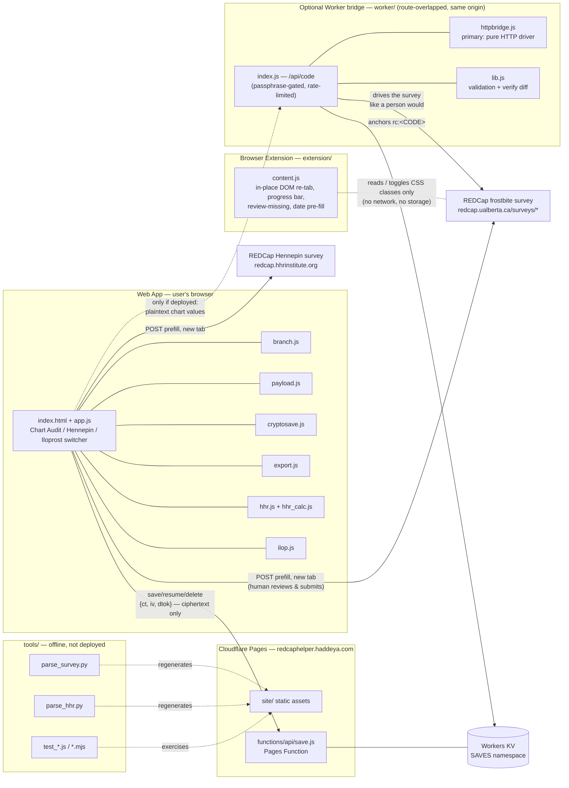

# Architecture

**Frostbite REDCap Helper** — Shahzaib Ahmed, Haddeya Sultani. MIT licensed.
Live web app: <https://redcaphelper.haddeya.com> · Repo: <https://github.com/Shozy3/frostbite-redcap-helper>

This document describes how the pieces fit together. For "how do I run/deploy
this", see [DEPLOY.md](DEPLOY.md); for the save-code ↔ REDCap bridge, see
[REDCAP_BRIDGE.md](REDCAP_BRIDGE.md); for the test suite, see
[TESTING.md](TESTING.md); for the Hennepin scoring model, see
[HHR_SPEC.md](HHR_SPEC.md).

## 1. Overview

The project is **two independent, complementary deployables plus an offline
toolchain**, all serving one goal: get high-grade frostbite chart-audit data
into REDCap faster and with fewer errors, without ever becoming a second
system of record.

| Deployable | Where it runs | What it is |
|---|---|---|
| **Browser extension** (`extension/`) | Chrome/Edge, on the live REDCap survey page | A Manifest V3 content script that reshapes the one long survey into 7 tabs *in place*. No network, no storage. |
| **Web app** (`site/` + `functions/`, optionally `worker/`) | Cloudflare Pages, `redcaphelper.haddeya.com` | A static, client-side-only app offering the same chart audit as a clean standalone form, plus a Hennepin Score calculator and an Iloprost dose calculator, with an optional encrypted save/resume-by-code feature. |
| **Toolchain** (`tools/`) | Developer machine, offline | Python parsers that regenerate the web app's data dictionaries from a saved copy of the real REDCap survey HTML, and a hand-rolled Node/jsdom test suite. Not deployed. |

Both deployables treat REDCap as the **sole system of record**. The extension
never leaves the REDCap page; the web app's Chart Audit tool only ever
*prepares* a submission that a human reviews and submits inside REDCap itself.

## 2. Components

### 2.1 Browser extension — `extension/`

```
extension/manifest.json   MV3 manifest, scoped to https://redcap.ualberta.ca/surveys/*
extension/content.js      all logic (~750 lines)
extension/styles.css      scoped styling for the injected UI
```

`content.js` waits for the survey's question table to render, then:

- **Groups by real field name into 7 tabs** — Patient & Demographics;
  Presentation & Assessment; Frostbite Grading; Amputation; Medications;
  Imaging & Consults; Disposition & Follow-up — because the survey's own
  section headers are misleading (most treatment/med/imaging/follow-up
  fields are mislabeled under a single heading).
- **Never moves, clones, or reparents a REDCap DOM node.** Every row stays
  exactly where REDCap rendered it, inside `#questiontable`, in original
  order. A tab switch is purely `classList.toggle('fbh-tab-hidden', …)` on
  existing rows. Because nothing is restructured, REDCap's own branching
  logic and validation keep running underneath, unaffected.
- Adds a **live required-fields progress bar** and per-tab completion
  badges, computed by reading (never writing) form values and REDCap's own
  branch-driven visibility.
- Adds a **"Review missing" jump list** that switches tab, scrolls, and
  briefly highlights a blank required field.
- **Pre-fills a few date/datetime fields** (`date_of_birth`,
  `time_of_ed_arrival`, `md_assessment_time`, `rewarming_time`) with today's
  day/month and a sentinel year, but only when the field is still empty, and
  fires the same `input`/`change`/`blur` events a real keystroke would —
  REDCap validates the value exactly as if the user had typed it.
- Detects the wrong page or too few fields and does nothing (with a small
  on-page notice); any runtime error triggers a self-cleanup that strips its
  own classes/DOM and leaves the form exactly as REDCap rendered it.

By design it makes **no network calls** (no `fetch`/`XMLHttpRequest`/
`sendBeacon`/`WebSocket`) and uses **no storage** (no `localStorage`,
`sessionStorage`, `IndexedDB`, or cookies) — see the DevTools checklist in
[TESTING.md](TESTING.md).

### 2.2 Web app — `site/`

A hand-written, dependency-free, no-build static site. `site/index.html`
loads a fixed sequence of plain `<script>` tags (no bundler, no framework);
each module attaches one global (`window.FB`, `window.FBDATE`,
`window.FBCRYPTO`, …) so the browser and the Node test suite load the exact
same code.

| Module | Role |
|---|---|
| `app.js` | The orchestrator (~1,300 lines): the passphrase gate, the three-tool top switcher (Chart Audit / Hennepin / Iloprost), building the Chart Audit form from the data dictionary, the in-tab `sessionStorage` draft, wiring calculator results into Chart Audit fields, and the save/resume UI. |
| `branch.js` | A small, `eval`-free tree evaluator that mirrors REDCap's own branching logic (`and`/`or` of `eq`/`ne`/`nonempty`/`checked` leaves), so the rendered form shows/hides fields exactly like the real survey. |
| `payload.js` | `buildPayload()` turns the in-browser form state into the exact `name=value` pairs REDCap's own prefill mechanism expects (dates converted to `YYYY-MM-DD`, checkboxes exploded to `var___code=1`); only fields currently visible under branching are sent. Also builds the "complete visible-field intent" used by the optional bridge's verify step. |
| `datemask.js` | A typed `DD-MM-YYYY` (and `DD-MM-YYYY HH:MM`) input mask — chosen over native date/datetime inputs after a segmented-input year-entry bug — with pure, Node-tested formatting logic. |
| `cryptosave.js` | Client-side AES-GCM-256 encryption for the save/resume-by-code feature (see §3.3). |
| `export.js` | Renders the current form as a readable CSV or XLSX (decoded option labels, one row per field); the XLSX path lazy-loads a self-hosted SheetJS build (`xlsx.mini.min.js`) so the strict CSP never needs a CDN. |
| `dictionary.js` / `dictionary.json` | The Chart Audit's generated data dictionary (fields, types, options, validation, branching trees, the 7-tab grouping) — regenerated by `tools/parse_survey.py`, never hand-edited. |
| `dict_hhr.js`, `hhr_calc.js`, `hhr_maps.js`, `hhr.js` | The Hennepin Score Calculator: its data dictionary, REDCap's own scoring equations baked in **verbatim** (not re-derived) so the score is provably identical to the original, the clickable-diagram polygon geometry, and the interactive UI (five anatomical figures under `site/hhr/img/`) — all regenerated by `tools/parse_hhr.py`. |
| `ilop.js` | The Iloprost infusion-dose calculator: pure dose-math helpers plus a UI that keeps its own saved logs in `localStorage` (never transmitted). |
| `config.js` | The SHA-256 hash of the access passphrase and a couple of display labels — the plaintext passphrase is never committed. |

`site/index.html` also carries the page's Content-Security-Policy
(`script-src 'self'`, `connect-src 'self'`, `form-action` limited to the two
REDCap origins), duplicated as HTTP headers in `site/_headers` for
Cloudflare Pages.

### 2.3 Pages Function — `functions/api/save.js`

The web app's only backend: a single Cloudflare Pages Function bound to a
Workers KV namespace (`SAVES`). It stores and serves **ciphertext only** —
`{ct, iv}` plus a `dtok` capability token — and never sees a decryption key.
It exposes:

- `POST /api/save` `{ct, iv, dtok}` → a fresh short lookup id (or, for a
  bridge-minted code, the caller may supply that id — accepted only if the
  bridge already anchored it in KV, so an id can't be squatted).
- `GET /api/save?id=…` → `{ct, iv}` (404 if missing).
- `DELETE /api/save?id=…&dtok=…` → 204, only if `dtok` matches.

Records have no TTL — a save persists until the user deletes it. Overwrite
and delete both require presenting the matching `dtok`, so possession of a
bare id alone cannot clobber or erase someone else's record.

### 2.4 Optional Worker bridge — `worker/`

A **separate, optional** Cloudflare Worker that is not required for the app
to function. When deployed on a route that overlaps the Pages site (so calls
stay same-origin), it lets the web app's save code double as REDCap's own
native "Save & Return Later" return code, in both directions, without a
REDCap API token.

| File | Role |
|---|---|
| `worker/index.js` | Serves `/api/code`; gates on the shared access-passphrase hash and best-effort rate limits; tries the HTTP driver first, then falls back to a headless browser. |
| `worker/httpbridge.js` | **Primary path**: drives the survey with plain `fetch()` + HTML parsing — no headless browser, no daily browser-minutes budget. |
| `worker/lib.js` | Pure, framework-free validation and diff logic (payload cleaning, date/number/checkbox comparison), unit-tested independently of the Worker runtime. |
| `worker/wrangler.jsonc` | Route, KV binding (the same `SAVES` namespace `functions/api/save.js` uses), and tunables. |

This path is **not** zero-knowledge — plaintext Chart Audit field values
pass through the Worker so it can drive the public survey — and every save
is verified by reading the record back from REDCap and diffing it against
what was sent. If the Worker isn't deployed, the app silently falls back to
a random app-only code; nothing else breaks. Full trust model in
[REDCAP_BRIDGE.md](REDCAP_BRIDGE.md).

### 2.5 Toolchain — `tools/`

Not deployed; run by a developer when the source REDCap surveys change or
before a release.

- `parse_survey.py` reads a saved copy of the frostbite survey's HTML and
  regenerates `site/dictionary.json`/`dictionary.js`, transpiling REDCap's
  branching logic into the safe rule trees `branch.js` evaluates. It exits
  non-zero on a field type or branching shape it doesn't recognize, rather
  than silently generating something wrong.
- `parse_hhr.py` does the same for the Hennepin calculator survey,
  additionally baking REDCap's own `Calculations.jsCode` scoring equations
  verbatim into `site/hhr_calc.js` and re-parsing the clickable-diagram
  `<map>` geometry into `site/hhr_maps.js`.
- `test_*.js` / `test_*.mjs` — a hand-rolled Node assertion suite (no test
  framework) plus jsdom-backed UI tests, covering branching, date masking,
  the export/Hennepin (HHR)/Iloprost calculators, the encryption round-trip, the save
  API, and the bridge's pure logic. A representative run order is documented
  in [DEPLOY.md](DEPLOY.md).
- `hash.js` is a one-line helper to produce the SHA-256 of a new access
  passphrase for `site/config.js`.

## 3. Data flow

There are three independent ways data moves in this project — the extension
never leaves the page; the web app either posts a prefill to REDCap or
stores an encrypted save.

### 3.1 Extension, in place

```
REDCap survey page  ──(read DOM, toggle CSS classes only)──▶  same page
```

No request ever leaves the browser. The extension only reads field values
and visibility to compute progress, and only toggles a CSS class on rows it
never moved.

### 3.2 Web app → REDCap prefill

```
Chart Audit tool  ──POST __prefill + field values──▶  redcap.ualberta.ca survey (new tab)
Hennepin tool     ──POST __prefill + field values──▶  redcap.hhrinstitute.org survey (new tab)
```

`payload.js` builds the exact name/value pairs from the in-browser form
state (only currently-visible fields, dates converted to REDCap's format,
checkboxes exploded per option) and opens the real survey in a new tab,
pre-populated, for a human to review and submit. REDCap remains the system
of record; the web app never submits on the user's behalf. The Hennepin and
Iloprost calculators don't post to REDCap directly — their result is written
into a Chart Audit field first ("Use score" / "Use dose in Chart Audit"),
and only the Chart Audit's own "Open populated REDCap form for review"
button posts.

### 3.3 Save & resume by code

**Zero-knowledge path (always available):**

```
Browser: generate random 256-bit AES-GCM key
         encrypt {Chart Audit + Hennepin + Iloprost state} → {ct, iv}
         dtok = SHA-256(key)
         POST /api/save {ct, iv, dtok}  ──▶  Pages Function  ──▶  Workers KV
Browser: shows the user  <id>.<key>
```

Every saved record gets its **own fresh random key**, generated in the
browser — it is never derived from the access passphrase. The key travels
only inside the save code, as the part after the dot. The server (and
Cloudflare) receive and store only `{ct, iv, dtok}` — inert ciphertext plus
a proof-of-possession token for delete/overwrite — so they can **never**
decrypt a saved record, and one leaked code exposes exactly that one record.
Resuming on any computer means pasting the whole code; the browser fetches
`{ct, iv}` by the id half and decrypts locally with the key half.

**Optional REDCap-code bridge (only if `worker/` is deployed):**

```
Browser  ──POST /api/code {intended field values}──▶  Worker
Worker   ──drives the public survey (HTTP first, headless-browser fallback)──▶  REDCap
Worker   ──reads back REDCap's own return code, verifies by re-reading & diffing──▶  Browser
```

This path makes the save code identical to REDCap's native "Save & Return
Later" return code, so the user can resume directly inside REDCap or in the
app, either direction. It is explicitly **not** zero-knowledge — the Worker
handles plaintext Chart Audit values in order to type them into the survey —
which is a deliberate, documented trade-off for that interoperability (see
[REDCAP_BRIDGE.md](REDCAP_BRIDGE.md)). The Hennepin/Iloprost portion of the
state still rides along encrypted via the same `/api/save` blob store either
way. If the bridge isn't deployed, the app falls back to the random
app-only code above without anything breaking.

## 4. Deployment model

Everything ships on **Cloudflare Pages**, with one optional **Cloudflare
Worker** alongside it:

- **Pages project** (`frostbite-helper`, custom domain
  `redcaphelper.haddeya.com`) serves `site/` as static assets and bundles
  `functions/api/save.js` as a Pages Function. `wrangler.jsonc` at the repo
  root drives this: `pages_build_output_dir: "site"` and a `kv_namespaces`
  binding (`SAVES`) that the Function reads and writes.
- **Workers KV** — a single namespace (`SAVES`) holds every saved blob. It
  is shared, by binding, between the Pages Function and the optional
  bridge Worker, which is how one code can carry both the REDCap-side chart
  data and the app-only Hennepin/Iloprost state.
- **Optional bridge Worker** (`worker/`, its own `wrangler.jsonc`) deploys
  separately and is only reachable via a custom-domain route that overlaps
  the Pages site (`redcaphelper.haddeya.com/api/code*`) — never a
  `*.workers.dev` URL — so the web app calls it same-origin and the page's
  CSP (`connect-src 'self'`) never has to change. Leaving it undeployed is a
  fully supported configuration.
- `site/`, `functions/`, and `wrangler.jsonc` are kept at the **repo root**
  (not nested under `site/functions/`) because Cloudflare Pages'
  config-based deploy mode expects the Function directory there when a KV
  binding is required.
- Because there is no build step, deploying is `wrangler pages deploy`
  reading straight from the repo; regenerating the data dictionaries (via
  `tools/parse_survey.py` / `tools/parse_hhr.py`) and running the test suite
  are the only steps between a REDCap survey change and a redeploy. See
  [DEPLOY.md](DEPLOY.md) for exact commands.

## 5. Component diagram



## 6. Security notes

Saved records are encrypted client-side under a fresh random key generated
for that save alone; the server (Cloudflare Pages Function + Workers KV)
receives and stores ciphertext it has no way to decrypt. The access
passphrase in front of the web app is a soft UI gate, not a cryptographic
key and not real access control — it does not protect saved data, and a
deployment that needs stronger access control should put the site behind
Cloudflare Access. The browser extension makes no network requests and uses
no storage of any kind, so it has no data-handling surface to secure at all.
